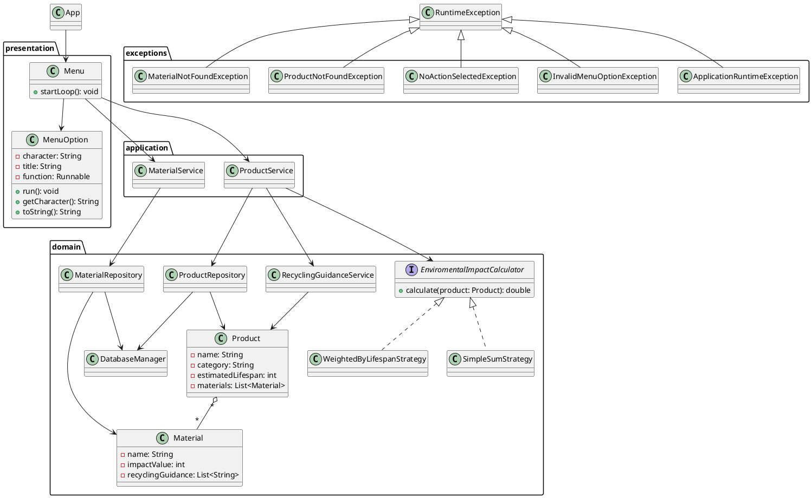

# Development Requirements
## Functional Requirements
- Create products with name, catrgory, etc.
- List registered products
- Define materials with: name, environmental impact value, and recycling
category/instruction
- Calculate total environmental impact for a product based on its materials
- Provide recycling guidance based on the product’s material composition
- Handle mixed-material products in a reasonable and documented way
## Non-functional Requirements
- Make the program easy to use
- Make the database be able to be backuped
- Make the user not be able to input invalid data
# System Boundary
## Inside Boundary
- Product management
- Impact calculation
- 
## Outside Boundary
- Database for products and materials
# Domain Concept Identification
PRODUCT (value object)
<br>name<br>category<br>estimated_lifespan<br>material_list

MATERIAL (value object)
<br>name

RECYCLING GUIDANCE (service)
<br>name

IMPACT CALCULATOR (service)

DATABASE MANAGER (entity)


# CRC Cards

## Product Service - service
The Product Service class is responsible for providing functionality concerning the product to the user. It knows about the product and its composition.
| Responsibility | Collaborators |
| :------------- | :------------ |
| Know the product composition | Environmental Impact Calculator |
| Fetch detailed information about any product | Product |
| Have access to the database | |
| Expose product composition for Environmental Impact Calculator | |

## Product - value
The Product class is responsible for storing its attributes such as name, category, estimated lifespan, and materials. It provides access to its materials for the Environmental Impact Calculator and Recycling Guidance Service.

| Responsibility | Collaborators |
| :------------- | :------------ |
| Know its attributes | Material |
| Hold list of materials | Environmental Impact Calculator |
| Expose composition for Environmental Impact Calculator | Recycling Guidance Service |

## Material - value
The material class is responsible for storing information about itself such as name and recycling guidance. The material knows its attributes. The material makes its composition available for the Product.
| Responsibility | Collaborators |
| :------------- | :------------ |
| Know its attributes | Product |
| Be reusable across Product |  |

## Recycling Guidance Service - service
The Recycling Guidance ervice provides the user with the guidance based on the product’s material or category. Based on the materials and it receives a proper guidance from the database through Product.
| Responsibility | Collaborators |
| :------------- | :------------ |
| Identify the material(s) of a product | Product | | |
| Curate recycling guidance |  |
| Handle mixed materials |  |

## Environmental Impact Calculator - service
The Environmental Impact Calculator calculates the environmental impact of a product based on its material. It uses the composition of a product to calculate the environmental impact.
| Responsibility | Collaborators |
| :------------- | :------------ |
| Calculate environmental impact | Product |


<!-- ## Database Manager - entity
| Responsibility | Collaborators |
| :------------- | :------------ |
| Hold database credentials |  |
| Fetch from database |  |
| Store in database |  | -->

## Menu - entity
| Responsibility | Collaborators |
| :------------- | :------------ |
| Store menu options | Product |
| Display menu options |  |
| Handle user input |  |

# UML Class Diagram

# Package Structure
```
presentation/
    Menu.java
    MenuOption.java

application/
    ProductService.java
    MaterialService.java

domain/
    Product.java
    Material.java
    ProductRepository.java
    MaterialRepository.java
    RecyclingGuidanceService.java
    EnviromentalImpactCalculator.java
    SimpleSumStrategy.java
    WeightedByLifespanStrategy.java
    DatabaseManager.java

exceptions/
    ApplicationRuntimeException.java
    InvalidMenuOptionException.java
    NoActionSelectedException.java
    ProductNotFoundException.java
    MaterialNotFoundException.java

src/test/java/se/hkr/ood/domain/
    ProductTest.java
    MaterialTest.java
    ProductRepositoryTest.java
    MaterialRepositoryTest.java
    RecyclingGuidanceServiceTest.java
    SimpleSumStrategyTest.java
    WeightedByLifespanTest.java
  ```
#   Flow Diagram
  ```
  @startuml
start

:Start application;
:Open main menu;
:Display menu options;

while (User has not selected q?) is (continue)
  :Read user input;

  if (Valid menu option?) then (yes)

    if (Fetch/Create Product selected?) then (yes)
      :Ask for product name;

      if (Product exists?) then (yes)
        :Fetch product using ProductService;
        :Display product information;
      else (no)
        :Ask user to create product;

        if (User confirms?) then (yes)
          :Enter product category;
          :Enter estimated lifespan;
          :Enter materials;
          :Create product;
          :Save product through ProductRepository;
        else (no)
          :Return to main menu;
        endif
      endif

    elseif (List Products selected?) then (yes)
      :Display registered products;

    elseif (Impact calculation selected?) then (yes)
      :Select strategy;
      :Calculate environmental impact;
      :Display result;
    endif

  else (no)
    :Handle invalid menu option;
  endif

endwhile (q selected)

:Exit application;
stop
@enduml
```

# Git Commands
`git clone`<br>
`git clone https://github.com/flavio-colangelo/ood-project`<br>
`git checkout nameOFTheBranch`<br>
`git checkout -b nameOfTheBranch`<br>
bug/date/nameOfTheBug<br>
feature/addProducts<br>
`git status`<br>
`git add fileName.extension`<br>
`git add .`<br>
*.class<br>
`git commit -m 'enter your message here'`<br>
`git push origin branchName`<br>
`git pull branch` <br>
`git branch`<br>
`git branch -d nameOfTheBranch`
`git merge nameOfBranch`
`git fetch origin development`